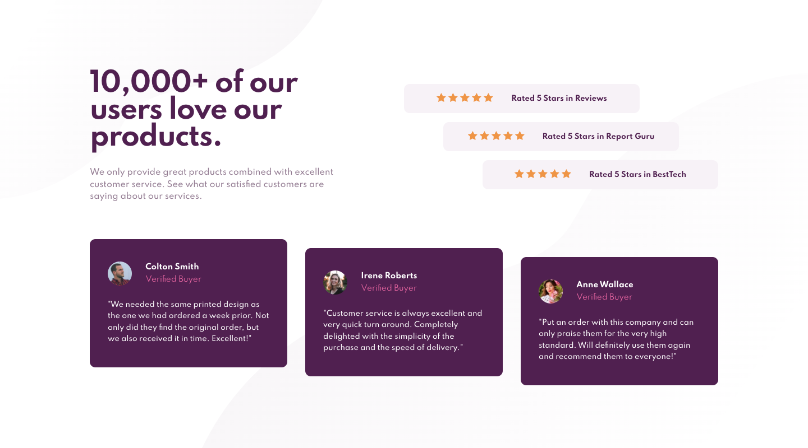
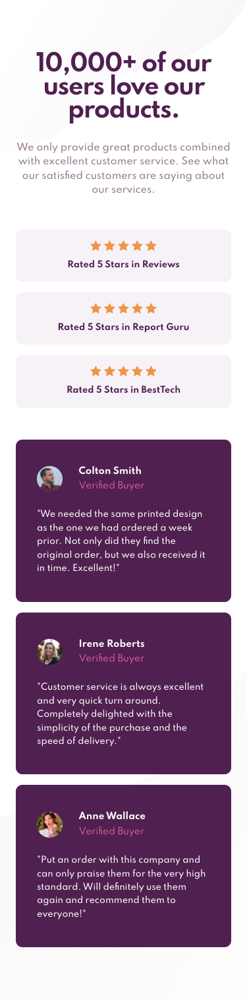

# Frontend Mentor - Social proof section solution

This is Max Ruuen's solution to the [Social proof section challenge on Frontend Mentor](https://www.frontendmentor.io/challenges/social-proof-section-6e0qTv_bA). Frontend Mentor challenges help you improve your coding skills by building realistic projects.

## Table of contents

- [Overview](#overview)
  - [The challenge](#the-challenge)
  - [Screenshot](#screenshot)
  - [Links](#links)
- [My process](#my-process)
  - [Built with](#built-with)
- [Author](#author)
- [Acknowledgments](#acknowledgments)

## Overview

### The challenge

Users should be able to:

- View the optimal layout for the section depending on their device's screen size

### Screenshot

#### Desktop Layout

#### Mobile Layout

### Links

- Solution URL: [Frontend Mentor](https://www.frontendmentor.io/solutions/social-proof-section-with-scss-and-bem-YfoCPLejJ)
- Live Site URL: [Netlify](https://rd-challenge-social-proof-section.netlify.app/)

## My process

### Built with

- HTML / CSS
- SCSS
- BEM naming conventions
- Flexbox
- SVG
- Mobile-first workflow

## Author

- Frontend Mentor - [@ruuendigital](https://www.frontendmentor.io/profile/ruuendigital)
- Twitter - [@maxruuen](https://www.twitter.com/maxruuen)
